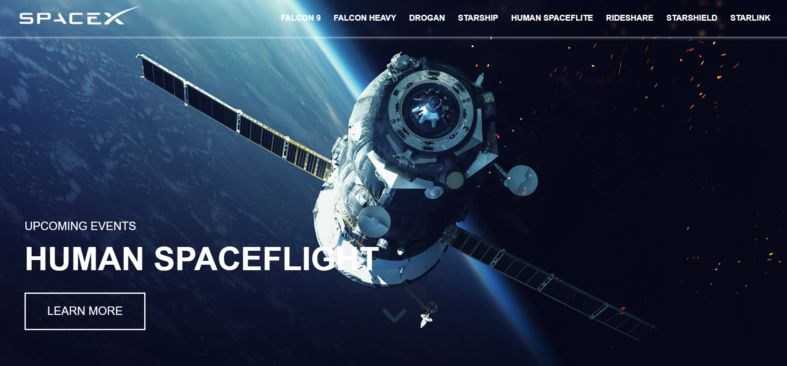
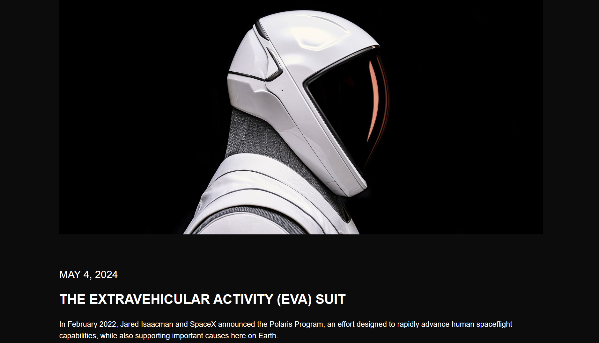

# SpaceX 🛰️  
## Overview

This project is a modern clone of the official SpaceX website designed to showcase my web development skills. It replicates key functionalities and design elements of the original SpaceX site with a responsive and dynamic user interface.

## Features ✨

- **Responsive Design :** Optimized for mobile, tablet, and desktop.
- **Dynamic Content :** Utilizes dynamic routing to present updated SpaceX launch information.
- **Interactive UI Elements :** Engaging visuals and animations similar to the original site.
- **Server-Side Rendering :** Uses EJS templates for efficient rendering.
- **RESTful API Integration :** Seamlessly fetches and displays real-time data.
- **Modern Styling :** Custom CSS with a maintainable, clean codebase.

## Built With 🛠️

- **Frontend:** HTML5, CSS3, JavaScript, EJS
- **Backend:** Node.js, Express.js
- **Templating Engine:** EJS (Embedded JavaScript)
- **Deployment:** Render
- **Version Control:** Git & GitHub

## 🖼️ Preview

